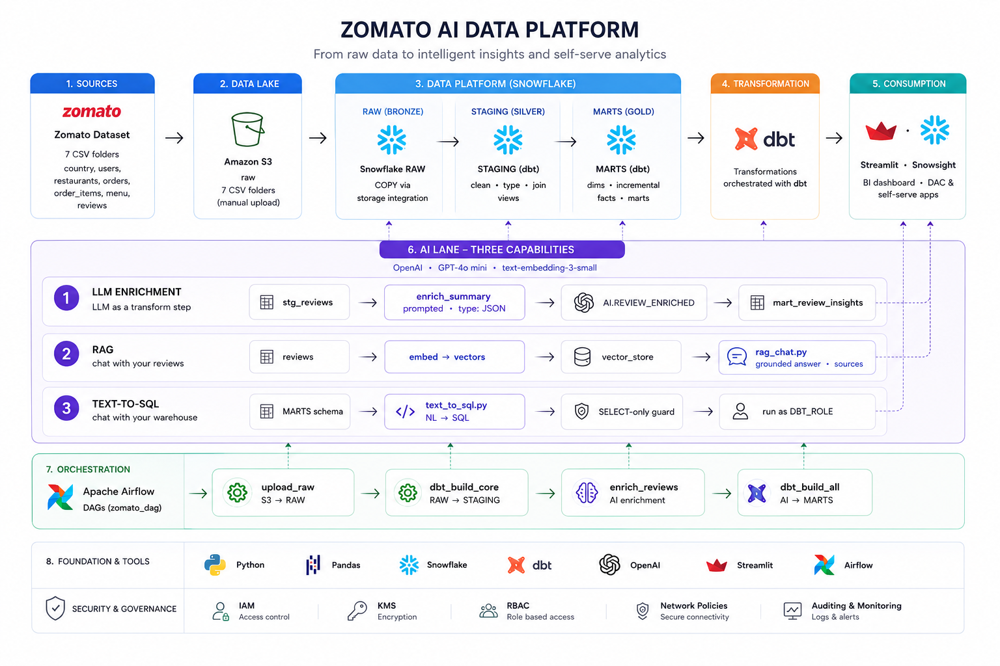

# Zomato AI Data Engineering

End-to-end batch pipeline:

**CSV → Amazon S3 → Snowflake → dbt → Airflow → OpenAI**

It loads food-delivery data into Snowflake, transforms it through RAW, STAGING, and MARTS layers, then adds review enrichment, RAG chat, and text-to-SQL apps.



> 📂 **Dataset + project slides:** [Google Drive folder](https://drive.google.com/drive/folders/1FEnGWMHhHzzTUCZOw1-YnH2v3DMuM-rs?usp=sharing) — download the CSVs here and place them under `data/` (they're too large to commit to the repo).

## Pipeline

| Layer | Where | What |
|---|---|---|
| **Source** | `data/` | Restaurants, users, food, menu, orders, order items, and reviews |
| **Lake** | Amazon S3 | One bucket, `raw/<table>/` folder per CSV |
| **Bronze** | Snowflake `ZOMATO.RAW` | `COPY INTO` from S3 via a keyless storage integration |
| **Silver** | Snowflake `ZOMATO.STAGING` | dbt staging views — clean, type, rename every source |
| **Gold** | Snowflake `ZOMATO.MARTS` | Dimensions, incremental facts, business marts, and snapshots |
| **AI** | Snowflake `ZOMATO.AI` | LLM-enriched reviews (sentiment/topic), RAG chat, text-to-SQL |
| **Orchestration** | Airflow (Docker) | One daily DAG: load → transform → enrich → AI mart |

## Tech stack

Python, Pandas, Amazon S3, Snowflake, dbt, Airflow 3, OpenAI, and Streamlit.

## Structure

```
├── airflow/                  # Dockerized Airflow DAG
├── zomato/                   # dbt models, tests, and snapshots
├── ai/                       # Enrichment, RAG, and text-to-SQL apps
├── snowflake/                # Snowflake setup and load SQL
├── aws/iam/                  # S3 access policies
└── docs/architecture.png     # Architecture diagram
```

> Download the dataset and slides from the [Google Drive folder](https://drive.google.com/drive/folders/1FEnGWMHhHzzTUCZOw1-YnH2v3DMuM-rs?usp=sharing), then place the CSVs under `data/`. Large data, logs, and dbt artifacts are not committed.

## Workflow

1. Upload CSVs to `s3://<BUCKET>/raw/<table>/`.
2. Run `snowflake/01_setup.sql` through `05_copy_into.sql` in Snowsight. The S3 connection uses a keyless storage integration; see `aws/iam/`.
3. Run dbt to build and test the staging and mart layers.
4. Run the Airflow DAG:

```
reload_raw  →  dbt_build_core  →  enrich_reviews  →  dbt_build_ai
(S3 → RAW)      (dbt build + tests)  (review enrichment)   (AI mart)
```

## Running it

```bash
# dbt
cd zomato
dbt debug && dbt build --exclude tag:ai

# Airflow
cd airflow
cp example.env .env          # fill in credentials
docker compose build && docker compose up -d
# Open http://localhost:8080 and trigger zomato_batch

# AI apps
export OPENAI_API_KEY=sk-...
python ai/enrich_reviews.py
streamlit run ai/rag_chat.py      # chat with reviews
streamlit run ai/text_to_sql.py   # chat with the warehouse
```

Credentials are provided through environment variables. See `airflow/example.env` and `ai/example.env`.
